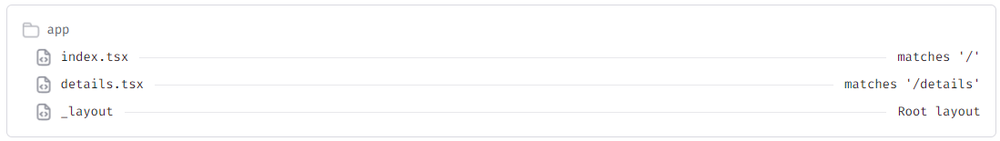
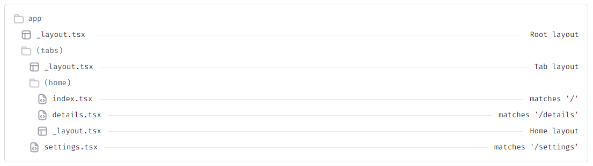

# Welcome to the Automated Home Control App 👋

This is an [Expo](https://expo.dev) project created with [`create-expo-app`](https://www.npmjs.com/package/create-expo-app). If questions arise concerning routing please view the documentation and FAQs on the expo app website

## Get started

1. Install dependencies
   Node will need to be installed if it has not yet already. Please follow the [React Native Official Setup](https://reactnative.dev/docs/set-up-your-environment) for information on how to set up the dev environment.
   This project relies on many dependencies provided by React.JS and other community based components. To ensure proper operation of the application and dev environment, run this command in the console which will automatically install all packages listed in the package.json

   ```bash
   npm install
   ```

2. Start the app

   Starting the app allows us to view it on an emulator for IOS or Android. If using Expo the start command is usually

   ```bash
    npx expo start
   ```

   However, I have a start script so you may use the traditional

   ```bash
   npm start
   ```

3. Making edits

   If you plan on creating new screens, components, or tabs, make sure to include the proper imports. The base import for any React Native project is

   ```js
   import * as React from "react";
   ```

   This will allow you to use all React Hooks and start developing with React.

In the output, you'll find options to open the app in a

- [development build](https://docs.expo.dev/develop/development-builds/introduction/)
- [Android emulator](https://docs.expo.dev/workflow/android-studio-emulator/)
- [iOS simulator](https://docs.expo.dev/workflow/ios-simulator/)
- [Expo Go](https://expo.dev/go), a limited sandbox for trying out app development with Expo

You can start developing by editing the files inside the **app** directory. This project uses [file-based routing](https://docs.expo.dev/router/introduction). All screen stacks should be present in the app folder, while tabs are contained in the (tabs) folder. Any created components can be found in the components directory. There are a few provided components not used in the project, for this project the FlatButton and IconButton were primarily used. Any images and fonts can be found in the assets directory. The remaining directories and files are created when the project is created and is not necessary to understand for editing the application.

## React.JS and React Native

React Native is an extension of the React.JS library and functions in essentially the same way. The main differences is that React Native uses custom components or "tags" that map to native UI elements, while React.JS uses traditional HTML tags. An example of these components are:

```js
<View>
  <Text> Sample Text </Text>
</View>
```

The `<View>` tag is similar to a `<div>` in HTML as it acts as a container to wrap other components such as `<Text>`, `<Image>`, or even other `<View>` components. Custom components are also used as wrappers in React Native. For example:

```js
<Pressable style={styles.resetButton} onPress={resetHandler}>
  <Text style={styles.buttonText}>Reset Setup</Text>
</Pressable>
```

The `<Pressable>` Component is essentially a button that can be pressed on a smartphone. Anything wrapped within the `<Pressable>` component will be considered a pressable button, and any component pressed on the phone within this tag will trigger any onpress functions.

---

If we take a closer look at the `<Pressable>` component, we should notice that within the <> tags, you can add functionality and configurations to certain components called props. These are essentially parameters in other languages. The `<Pressable>` component accepts things like a style, onpress function, onlongpress function, and others. However, the `<View>` component doesn't contain an onpress function prop, but contains other useful props such as accessability actions. Details on what props each component has can either be found on the [React Native Website](https://reactnative.dev/docs/components-and-apis), if it is community supported it should be found on the [community github](https://github.com/react-native-community). Components can be found elsewhere, and many companies have developed their own custom components that can be installed or subscribed to, but for the purposes of this project the base React Native components and React Native Community components were used.

## Expo Router

For the purposed of handling screen changes, routing, and emulating the project, the Expo Router was used. Expo is used extensivly in React Native projects so there is a lot of good support and documentation that can be found on the [Expo Website](https://expo.dev). If you want to create a new project, you can use this command in the React Native terminal

```bash
npx create-expo-app project-name
```

This will create a basic expo app that can be used as a launch point for new development.

### Navigation

The expo router has its own navigation built in, so be sure not to use ReactNavigationComponent AND expo router as this will cause issues. The file sructure should follow this pattern in order for the expo router to work.

Stack Navigator Example:



Tabs Navigator Example:



A stack navigator is essentially stacking screens on top of eachother with each screen containing a back button. A tabs navigator will include tabs at the top or bottom for navigating between pages. Each form will need a root layout that will define the screens and tabs. In our example we use both a stack and tab navigator. The following is an example of a stack navigator with a screen.

```js
<Stack>
   <Stack.Screen
      name="index"
      options={{
         title: "App Name",
         headerShown: true,
         headerTransparent: true,
         headerTitleStyle: {
         fontWeight: "bold",
         fontSize: 20,
         },
      }}
   />
<Stack>
```

The `<Stack.Screen/>` component does not have closing tags, instead it is just a single tag denoted by the </>. This happens with some components that do not need to wrap other components, and it only takes props. The `<Stack.Screen/>` component has many props options but it is all used to configure the screen, headers, and footers. To add more screens be sure to place the screen definition here in order to properly route to the new screen. Tabs navigation is structured as follows:

```js
<Tabs screenOptions={{ tabBarActiveTintColor: "#333333" }}>
  <Tabs.Screen
    name="wh-control"
    options={{
      headerTransparent: true,
      tabBarStyle: {
        backgroundColor: "transparent",
        position: "absolute",
        elevation: 0,
        borderTopWidth: 0,
      },
      tabBarInactiveTintColor: "#C9C9C9",
      title: "Control",
      tabBarIcon: ({ color, focused }) => (
        <TabBarIcon name={focused ? "menu" : "menu-outline"} color={color} />
      ),
    }}
  />
</Tabs>
```

As we can see the structure is very similar to the stack navigator just with different props. If both navigators are used, it is important that the (tabs) directory must be included in the stack navigator as a screen that way when you route to the tabs it will route to the root layout of the tabs directory.

## Component Structure

Components in React Native need a default export, this is what is exported to as native UI of the application for viewing on the smart phone. Take a quick look at the [index.jsx](./app/index.jsx), ignoring the commented code. If you look closely you will notice that we have a default export function denoted by `export default`. Then we have some code, followed by a return statement. The return statement is what will be displayed on the native UI. This will usually consist of various components like `<View>`, `<Text>`, and custom components like `<IconButton>` can be used here as well. If you have experience with HTML you will notice it looks remarkably similar to HTML, that is why files are typically called .jsx files for JavaScript XML. Functions, states, and other variables are to be defined and included before the return statement. This does not disclude regular JS be included within the return statement, in fact it is used often. However, if native JS is needed, be sure to include it with {} to tell the render bridge that is native JS and not a React Native component.

# Video Walkthrough

A short walkthrough of the code and functionality is found [here](https://youtu.be/q4O4khsZwGI)
# Automated-Home-Control-System
